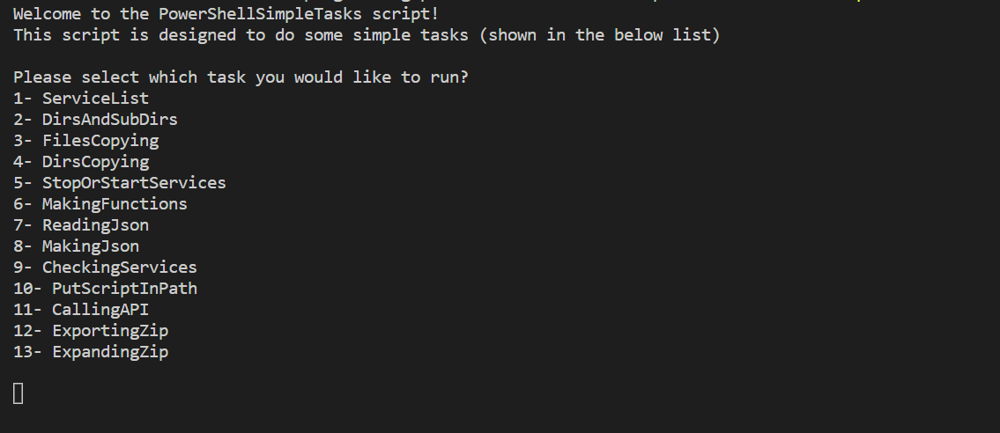

# PowerShellSimpleTasks
Simple tasks done in a clean and organized way in PowerShell.

# How does it work?
After running [RunTasks.ps1](./RunTasks.ps1) script, you will see a main menu with few options (options might increase over the time).

Enter the number of task that you would like to execute and you will see the explanation about that task inside of console.
